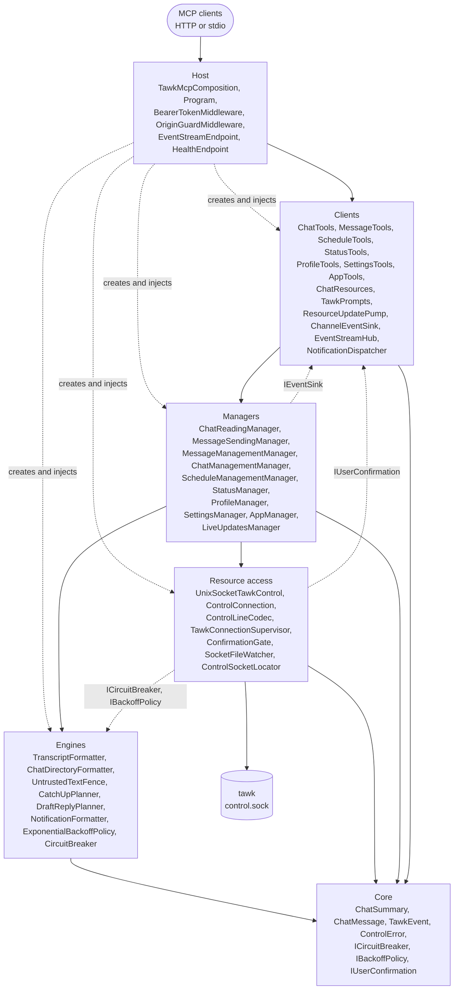
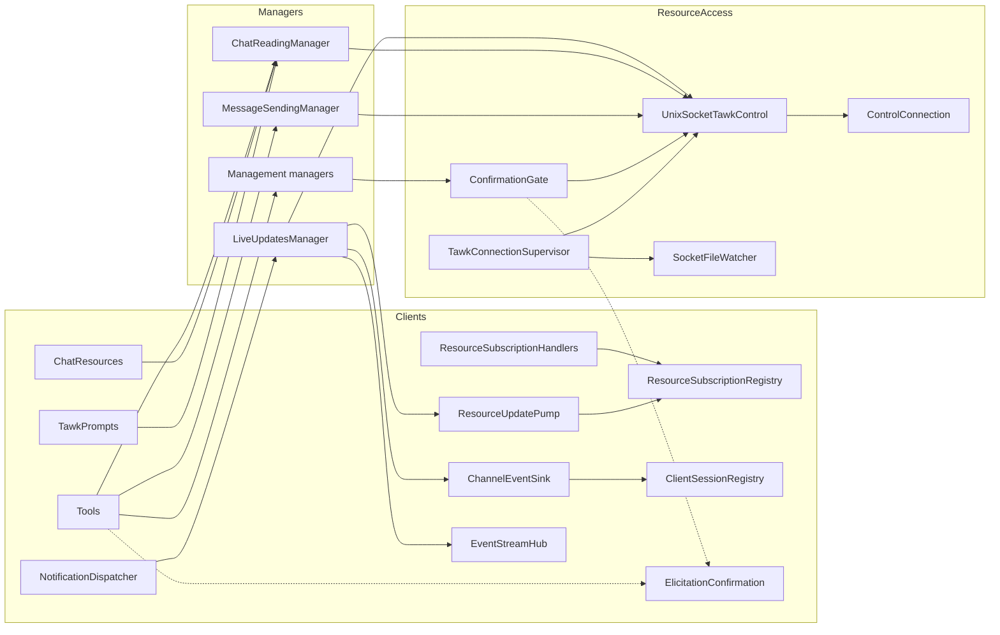

# Architecture

## Table of Contents

- [Overview](#overview)
- [Layers](#layers)
- [Component map](#component-map)
- [Components](#components)
- [Composition root](#composition-root)
- [Concurrency](#concurrency)
- [Design principles](#design-principles)
- [Adding things](#adding-things)

## Overview

tawk-mcp is a .NET 10 program built on the official MCP C# SDK (`ModelContextProtocol` and `ModelContextProtocol.AspNetCore` 2.2.0), arranged in [iDesign](https://www.idesign.net/) layers. The volatile parts (tawk's socket protocol, the MCP transport, the model-facing text) sit behind interfaces, so each can change without touching the rest. Every interface is bound to its implementation in exactly one place, `TawkMcpComposition` in the host.

Each class, record, enum and interface lives in its own file. Nullable reference types, the .NET analysers and warnings as errors are on for every project (`Directory.Build.props`).

## Layers

| Layer | Project | Responsibility | May call |
| --- | --- | --- | --- |
| Host | `Tawk.Mcp.Host` (assembly `tawk-mcp`) | The composition root, the command line, streamable HTTP hosting (the default) and stdio hosting, the bearer token and origin middleware, `/events` and `/healthz` | Everything, to compose it |
| Clients | `Tawk.Mcp.Clients` | MCP tools, resources and prompts, resource subscriptions, the channel sink, the event stream hub, session tracking, the notification dispatcher | Managers |
| Managers | `Tawk.Mcp.Managers` | Use cases: reading, sending, managing messages, chats, scheduled messages, statuses, the profile, settings and the app, and live updates | Engines, resource access |
| Engines | `Tawk.Mcp.Engines` | Rules with no I/O: transcript and chat formatting, untrusted text fencing, catch-up and draft planning, notification headers, exponential backoff, the circuit breaker | Core |
| Resource access | `Tawk.Mcp.ResourceAccess` | tawk's control socket: the line codec, the connection, the control client, the connection supervisor, the socket locator and watcher, the confirmation gate | Core |
| Core | `Tawk.Mcp.Core` | Records for tawk's values, events, error codes, the `TawkControlException`, and contracts shared across layers (`ICircuitBreaker`, `IBackoffPolicy`, `IUserConfirmation`, `IDelay`) | Nothing above |

Solid arrows are calls; dotted arrows are construction and calls through an interface owned by a lower layer. Calls flow downwards. Managers never call each other; tools compose them where a use case needs two (the chat tools use the reading and the chat management managers). Three calls go the other way, each through a contract in a lower layer so no project references one above it:

- The live updates manager hands updates to `IEventSink` implementations, which are clients.
- The connection supervisor and control client use `ICircuitBreaker` and `IBackoffPolicy` from core; the engines implement them.
- The confirmation gate asks the user through `IUserConfirmation` from core; the clients implement it with MCP elicitation.

## Component map

## Components

### Core

Records mirror tawk's values in [CONTROL.md](https://github.com/loganventer/tawk/blob/main/CONTROL.md): `ChatSummary`, `ChatMessage` (with `ReplyRef` and `LinkCard`), `StatusItem`, `ScheduledItem`, `UnreadSummary`, `ChatInfo` and `GroupMember`, `HelloInfo`, and result records such as `MessagePage`, `SentMessage` and `ScheduledMessage`. They are read with `System.Text.Json` and a snake_case naming policy, and unknown fields are ignored, as the protocol requires.

`TawkEvent` is the root of the notifications: `MessageEvent`, `ChatUpdatedEvent`, `ByeEvent`, `ApprovalEvent`, `UnknownEvent`, and `ConnectionStateEvent`, which tawk-mcp raises itself when its connection changes. `ControlError` carries tawk's error (`code`, `message`, `candidates`, `retry_after`), `ControlErrorCode` names the codes, and `TawkControlException` is how every failure travels upwards.

### Resource access

- `ControlLineCodec` writes requests as one JSON line (`{"id","op","args"}`) and reads each incoming line as an answer or a notification.
- `ControlConnection` owns one socket. A single reader loop matches answers to waiting requests by id through a `TaskCompletionSource` per request, so answers may arrive in any order. It passes approval notifications to the request they belong to, times out reads (writes are exempt), and fails everything still waiting when the connection ends.
- `UnixSocketTawkControl` implements `ITawkControl` for the managers and `ITawkConnector` for the supervisor. A request uses the current connection, waits up to 2 seconds for one in progress, or fails at once while the circuit is open. It publishes events to every reader through `EventBroadcaster`, which also hands the latest connection state to a reader that starts late.
- `TawkConnectionSupervisor` is a hosted service that keeps connecting: backoff between attempts, the circuit breaker around them, and an immediate attempt when `SocketFileWatcher` sees `control.sock` appear or a request is waiting (`ConnectSignal`).
- `ConfirmationGate` runs writes. When tawk answers `needs_confirmation`, it keeps the token in a local variable, asks the user through `IUserConfirmation`, and calls `confirm` or `cancel_confirmation`. The token never leaves it.
- `ControlSocketLocator` finds the socket (flag, `TAWK_CONTROL_SOCKET`, `$XDG_RUNTIME_DIR`, `~/.local/state`).

### Engines

- `TranscriptFormatter` writes `[2026-09-30 18:02] Mom: text` lines with reply, media, forward, deletion, link, edit, reaction and status markers, indenting extra lines. `ChatDirectoryFormatter` does the same for chats, chat details and scheduled messages.
- `UntrustedTextFence` wraps other people's text between fixed markers with a statement that it is data, and breaks up any run of angle brackets inside so the text cannot close the fence.
- `CatchUpPlanner` and `DraftReplyPlanner` write the prompt instructions. `NotificationFormatter` writes the one-line header of a channel event.
- `ExponentialBackoffPolicy` and `CircuitBreaker` (closed, open, half-open) take an injected random source and `TimeProvider`.

### Managers

Each manager is one area of use cases and returns model-ready text. The reading and sending managers call `ITawkControl` directly; the management managers go through `IConfirmationGate` so any answer that asks for confirmation is handled the same way. `LiveUpdatesManager` reads the event stream, subscribes to every chat after each connect, fences new messages for the model, and hands every update to each `IEventSink`.

### Clients

- Seven tool classes (`[McpServerToolType]`) hold the 42 tools. Each tool calls one manager and turns `TawkControlException` into a tool error result through `ControlErrorMessages`, so nothing crashes the call. Write tools take `IProgress<ProgressNotificationValue>` and report "Waiting for approval in tawk". Tools that may need confirmation take the request's `McpServer` and build an `ElicitationConfirmation` from it.
- `ChatResources` (`[McpServerResourceType]`) serves `tawk://chats` and `tawk://chat/{jid}`; `ResourceSubscriptionHandlers`, `ResourceSubscriptionRegistry` and `ResourceUpdatePump` handle subscriptions.
- `TawkPrompts` (`[McpServerPromptType]`) serves `catch_up` and `draft_reply`.
- `ChannelEventSink` sends `notifications/claude/channel`; `EventStreamHub` keeps the last 200 events for `/events`; `ClientSessionRegistry` and `SessionTracking` remember connected sessions; `ProtocolRevisionFilter` keeps clients on the initialize handshake.
- `NotificationDispatcher` is the hosted service that runs the live updates manager.

### Host

`Program` reads options (`TawkMcpOptionsBinder`: environment, then flags), runs a command (`print-token`, `healthcheck`, `--version`, `--help`) or serves. By default it uses `WebApplication` with `WithHttpTransport` in stateful session mode (sessions carry elicitation, subscriptions and notifications), binds Kestrel where `TAWKMCP_BIND` says, puts `OriginGuardMiddleware` and `BearerTokenMiddleware` in front, and maps `/mcp`, `/events` and `/healthz`. With `--stdio` it uses the generic host with `WithStdioServerTransport` and logs to stderr only. `FileTokenStore` and `FixedTokenStore` implement `ITokenStore`.

## Composition root

`TawkMcpComposition.AddTawkMcp` registers every implementation against its interface, the two hosted services, and the MCP server: server info and instructions, the `claude/channel` experimental capability (unless the channel is off), the tool, resource and prompt types, the subscribe and unsubscribe handlers, and two incoming message filters. Nothing else in the solution creates a service.

## Concurrency

- One reader task per connection reads tawk's socket; writes to the socket are serialised by a semaphore. Any number of requests may be in flight.
- The supervisor runs on its own background task and waits on a delay, a signal, or the end of the connection.
- Every reader of `ITawkControl.Events` gets its own unbounded channel. The live updates manager is the one reader in production, and hands each update to the sinks in turn; a failing sink is logged and skipped.
- The event stream hub gives each `/events` subscriber its own channel and keeps the replay buffer under a lock.
- Tool calls run on the MCP SDK's request tasks and share the one connection.

## Design principles

- **Dependency inversion.** Every dependency is an interface, bound in the composition root. Tests replace the lowest layer with hand-written fakes and a fake socket server.
- **Composition over inheritance.** Behaviour is assembled from small services. Inheritance is kept to the SDK's `BackgroundService`, the exception type, and the closed families of event and frame records.
- **Separation of concerns.** Formatting and fencing are engines, protocol details are resource access, MCP details are clients, hosting is the host.
- **Untrusted by default.** Anything written by other people is fenced before it reaches a model, in tool results, resources, prompts and channel events.
- **Never hang.** Every wait has a bound except a write waiting for the user, which tawk itself ends after 2 minutes.

## Adding things

- **A tool for a new tawk operation**: add the method to the manager for its area (or a new manager in its own file with its interface), call `ITawkControl` for reads or `IConfirmationGate` for writes, add the tool method to the matching tool class with a description that says what access it needs and that text is untrusted, register any new manager in `TawkMcpComposition`, add the operation to `UnixSocketTawkControl.WriteOps` if it may wait for approval, and add tests with `FakeTawkControl`.
- **A new error code**: add it to `ControlErrorCode` and `ControlErrorCodes`, and give it a message in `ControlErrorMessages`.
- **A new place for live updates to go**: implement `IEventSink` in the clients and register it.
