# How It Works

## Table of Contents

- [Start-up](#start-up)
- [Connecting to tawk](#connecting-to-tawk)
- [A read](#a-read)
- [A call for one account](#a-call-for-one-account)
- [A send with approval](#a-send-with-approval)
- [A send the agent approves itself](#a-send-the-agent-approves-itself)
- [A destructive request in two steps](#a-destructive-request-in-two-steps)
- [New messages](#new-messages)
- [A voice note's transcript](#a-voice-notes-transcript)
- [A TL;DR summary](#a-tldr-summary)
- [Reconnecting](#reconnecting)
- [The circuit breaker](#the-circuit-breaker)
- [A hung tawk](#a-hung-tawk)
- [HTTP requests](#http-requests)
- [A memory sync](#a-memory-sync)
- [The workflow check](#the-workflow-check)

## Start-up

1. `Program` binds the options from `TAWKMCP_*` variables and the command line. A bad value stops it with exit code 2.
2. `print-token`, `healthcheck`, `--version` and `--help` run and exit.
3. Otherwise the composition root registers every service. By default `WebApplication` starts Kestrel on `TAWKMCP_BIND:TAWKMCP_PORT` (127.0.0.1:8765) with stateful streamable HTTP sessions, creating the bearer token first if there is none. With `--stdio` the generic host starts with the stdio transport and logs to stderr only.
4. Two hosted services start: the connection supervisor, which starts connecting to tawk, and the notification dispatcher, which starts reading tawk's events. Neither waits for tawk, so the MCP server is ready at once whether or not tawk is running.

## Connecting to tawk

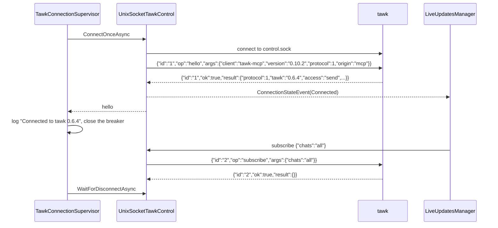

`hello` is always the first request on a connection, with origin `mcp`, which makes tawk ask you before every write. If the socket is missing, refuses the connection or is a stale file, the attempt fails and the supervisor waits (see [Reconnecting](#reconnecting)).

## A read

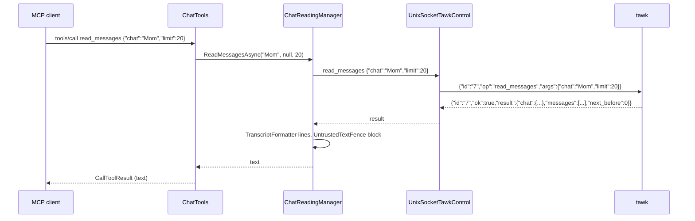

If tawk answers with an error, `ControlConnection` completes the request with a `TawkControlException`, and the tool turns it into an error result with a plain explanation, for example the candidates for an `ambiguous` name. Reading never marks anything as read.

## A call for one account

1. The model calls `send_message` with `account: "work"`.
2. `ToolResults.RunAsync` opens the account scope with `work` and runs the use case inside it.
3. The manager builds its request as always and hands it to `ITawkControl`, which is the `AccountScopedTawkControl` decorator.
4. The decorator reads the scope. With no account it passes the request on unchanged. With one, it looks at tawk's `hello`: if tawk did not say `multi_account`, the call is refused there and nothing is sent, because that tawk would act on its one number. Otherwise it adds `"account":"work"` to the arguments.
5. tawk serves the request from that account, under that account's level, and answers. An account closed to agents answers `not_found`.
6. The scope closes when the call ends. Work outside a tool call, such as the subscription to live events, has no scope and names no account.

Events come back the other way with `account` on them. `ControlLineCodec` puts it on the `TawkEvent`, and the notification text, the channel tag and the event stream each carry it from there.

## A send with approval

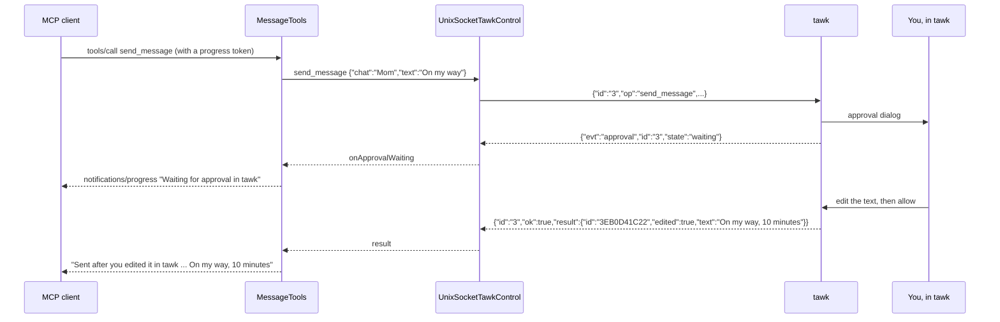

A write has no timeout on tawk-mcp's side while it waits for you; tawk answers `timed_out` after 2 minutes. If you decline, tawk answers `declined` and the tool says so. If tawk quits while the request waits, the request fails with a message saying the send may or may not have gone.

## A send the agent approves itself

Only when the instance was started with an admin token file and tawk's access is `admin`. The write tool no longer holds the call open: the request is parked under its id, and a second tool answers it.

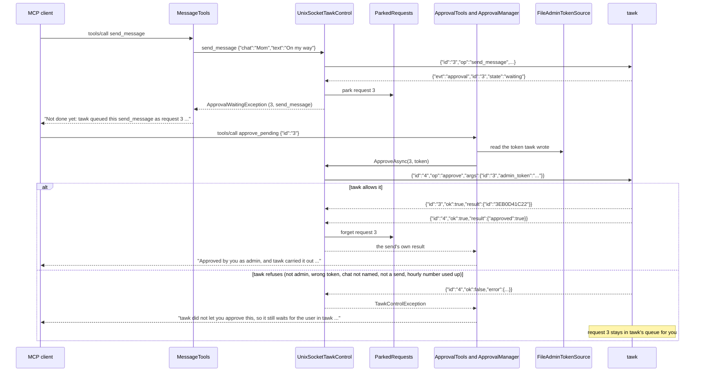

A write that tawk answers at once (your own "for this session" allowance, say) is never parked. A parked request that you answer in tawk, or that times out, is reported once by `list_pending` and then let go. At most 64 are kept.

## A destructive request in two steps

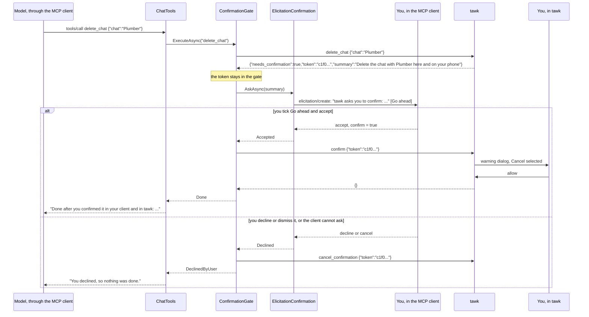

The model sees the tool call and its result. It never sees the token, and the elicitation goes from tawk-mcp to your client directly, so the model can answer neither question. There is no confirm tool. If the client does not support elicitation, the gate cancels at once and the tool answers "This needs your confirmation, and your MCP client cannot ask you. Do it in tawk instead."

## New messages

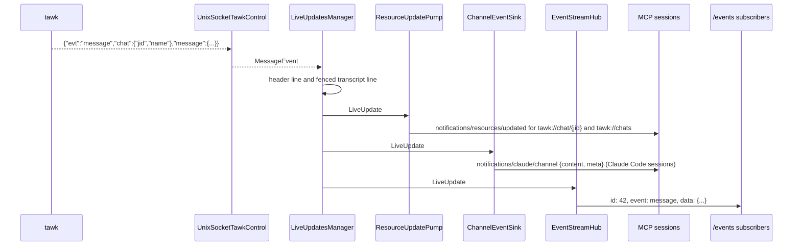

Unread count changes (`{"evt":"chat"}`) update resources and go to `/events` as `event: chat`. Sessions that have gone away are dropped when a notification to them fails.

`ChannelEventSink` ends a session's first channel event from each chat with a line naming the chat to read with `read_messages`, after the fenced text. `ChannelContextHints` remembers, per session, which chats have had one, and forgets a session when it ends. The line and the instructions both leave it to the agent: it gathers the history only when it lacks it.

Which messages reach the channel is decided in two places. tawk sends a message event only when its push setting for that kind is on (received, or sent by the user). `ChannelEventSink` then passes on what other people sent, and what the user sent only when `TAWKMCP_CHANNEL_OWN` is on, marking each event with `from_me`. Read receipts, reactions, edits and deletes, scheduled sends and online status follow the same two steps, each with its own switch in tawk and its own option here, and none of them counts as a workflow round.

Online status is the one event that is not about a message. tawk sends `presence` when the person in a one-to-one chat the user opened comes online or leaves; `ControlLineCodec` reads it into a `PresenceEvent`, `NotificationFormatter.Presence` writes one plain line for it ("Online status: Mom came online in \"Mom\"."), and `ChannelEventSink` sends it with `type="presence"`, a `state`, and `last_seen` where it is known, when `TAWKMCP_CHANNEL_PRESENCE` is on. It carries no message id, and it does not point at the chat's history or use up the chat's first-event pointer, since it says nothing about what was written. What arrives is what tawk knows from a chat the user opened, or from a lookup.

An agent can also ask. `get_online_status` (`PresenceTools`) goes to `PresenceManager`, which sends tawk's `presence` operation for one chat. tawk answers with what it knows and asks WhatsApp about that person, so the first answer is usually `unknown`; while tawk says it is watching, the manager waits through `IDelay` and asks again, up to `PresenceLookupOptions.Retries` times, and `PresenceFormatter` then says who is online, when someone offline was last seen, or why nothing is known. tawk refuses the operation unless the user switched on "Look up online status", and it never answers for a group or for a chat the agent may not use.

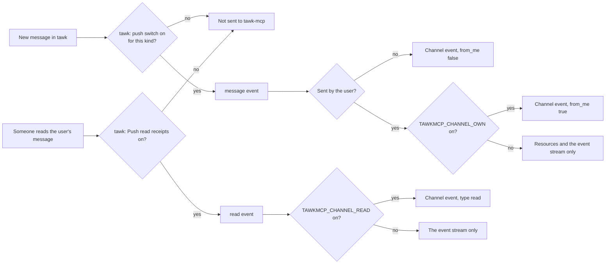

## A voice note's transcript

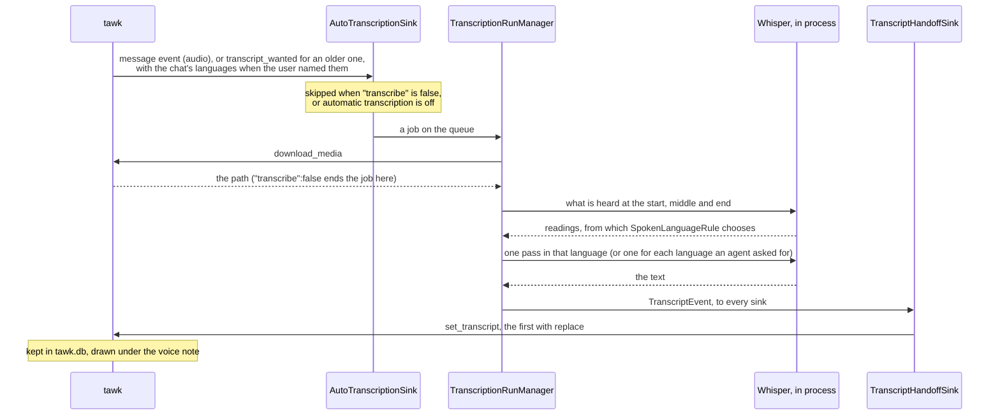

A job an agent asked for with `transcribe_message` takes the same path from the queue on. The channel sink tells the agent the result as before; the handoff sink is one more listener of the same event, so nothing about a job changed. tawk-mcp writes none of it to disk. A tawk whose `hello` lists no `transcripts` feature is sent nothing.

## A TL;DR summary

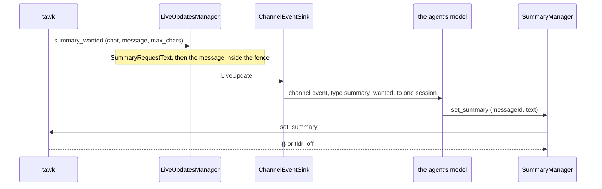

tawk chooses the agent and the messages; tawk-mcp only carries the request and the answer. The request needs channel events, so a client without them is never asked. The message is untrusted data like any other: the words telling the agent what to write are tawk-mcp's own and sit outside the fence.

## Reconnecting

```mermaid
sequenceDiagram
    participant K as tawk
    participant C as ControlConnection
    participant S as TawkConnectionSupervisor
    participant W as SocketFileWatcher
    participant L as LiveUpdatesManager
    participant P as ResourceUpdatePump

    K-->>C: {"evt":"bye"}, then the socket closes
    C->>C: fail waiting requests with Offline ("tawk quit")
    C-->>L: ConnectionStateEvent(Waiting)
    L-->>P: event: tawk {"state":"waiting"} also goes to /events
    S->>S: log "tawk went away; retrying"
    loop until tawk is back
        S->>S: wait backoff (500 ms doubling to 30 s, jittered), or a signal
        S->>K: connect: ENOENT or ECONNREFUSED
    end
    K->>W: control.sock appears
    W-->>S: signal (and a forced trial if the circuit is open)
    S->>K: connect, hello
    S->>S: log "Connected to tawk 0.6.4"
    C-->>L: ConnectionStateEvent(Connected)
    L->>K: subscribe {"chats":"all"}
    L-->>P: every subscribed resource gets notifications/resources/updated, then list_changed
```

While tawk is away, a tool call waits up to 2 seconds for a connection and then answers with the not-running message and the socket path. When the socket's folder does not exist yet, the watcher watches the nearest existing parent and moves down as folders appear.

## The circuit breaker

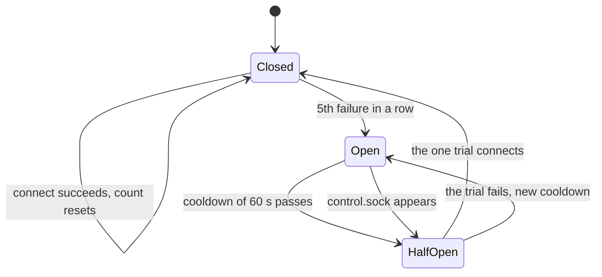

While the circuit is open, tool calls fail at once with "tawk has not answered N attempts; next try in Xs (or as soon as its control socket appears)", `/healthz` reports `circuit_open`, and `/events` subscribers get `event: tawk` with `{"state":"circuit_open"}`.

## A hung tawk

A read that gets no answer within 10 seconds (`TAWKMCP_REQUEST_TIMEOUT_S`) fails with an Offline error saying tawk looks hung. The control client counts it as a breaker failure and drops the connection, and the supervisor reconnects as after any other loss. Writes are exempt, because they may be waiting for you.

## HTTP requests

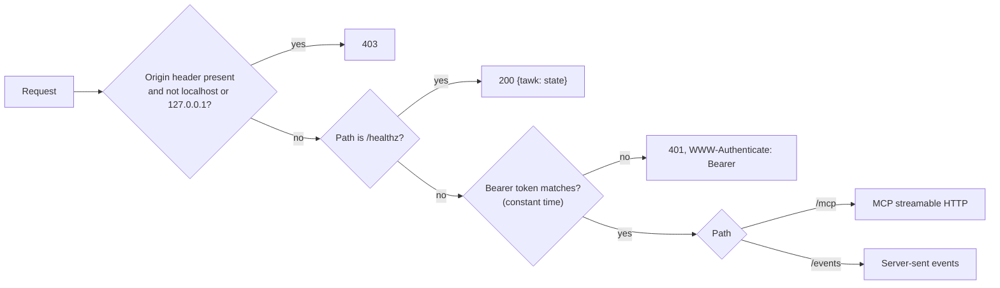

`/events` starts with a `: connected` comment and the current `event: tawk` state, replays kept events after `Last-Event-ID`, then streams new ones, with a `: heartbeat` comment after 15 quiet seconds.

## A memory sync

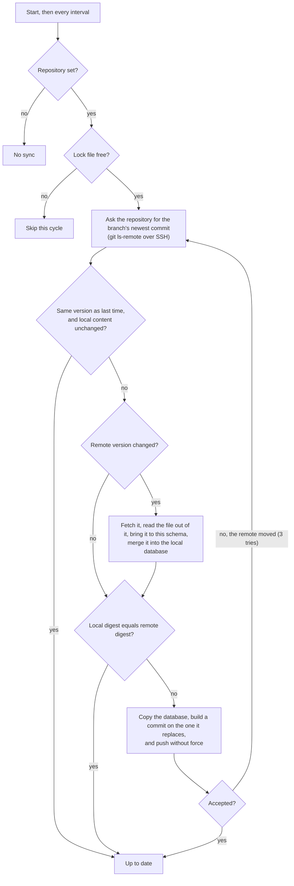

The merge takes each table in turn and matches rows by key. Where both sides have a row, the stronger source wins (user, contact, imported, inferred), then the newer `updated`, and an exact tie is settled by the row's content so both machines choose the same one. A delete leaves a tombstone: one newer than the winning row removes it everywhere, and a row changed after its tombstone survives and clears it. Rows that have lapsed are dropped before the merge and never brought back. Deleting a contact takes its fields, categories and observations with it on every machine.

The remote side is git over SSH. A version is the commit that holds the file. `GitMemoryRemote` keeps a bare repository beside the database, fetches only the newest commit into it, and builds the next commit there without a working copy, so the other files in the repository are carried along untouched. The push is a plain one: when another machine pushed first it is not a fast-forward, the repository refuses it, and the cycle starts again from the new commit.

The digest is a SHA-256 over the rows and tombstones in a fixed order, not over the file's bytes, so two machines holding the same memory compare equal and neither pushes.

## The workflow check

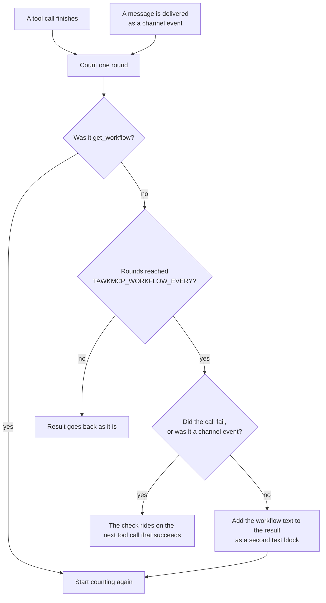

Each tool call passes through a filter after it has run. The filter counts a round, and when the count reaches `TAWKMCP_WORKFLOW_EVERY` it adds the workflow text to the result as a second text block and starts again. A message delivered to the agent as a channel event counts as a round too, and the check then rides on the agent's next tool call. A failed call counts but never carries the check, and `get_workflow` resets the count. The text is fixed in the source, followed by the user's own instructions file; nothing from a chat or from memory is ever part of it.
