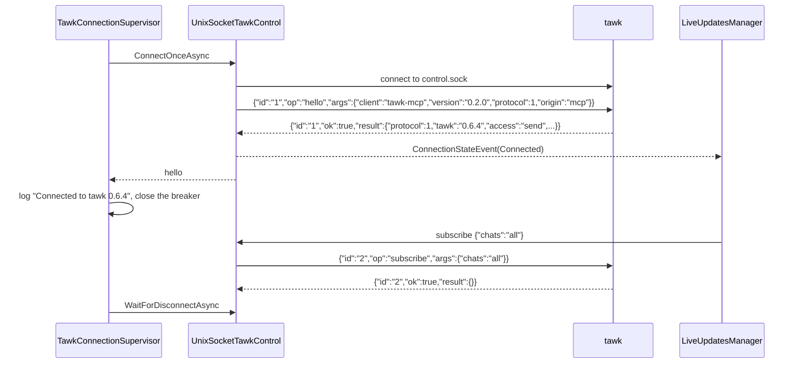
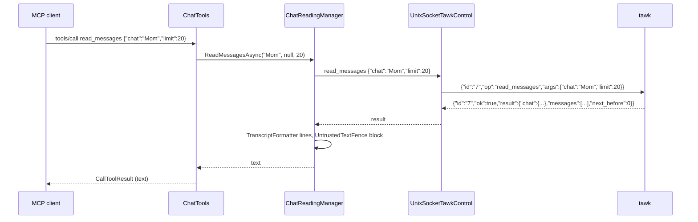
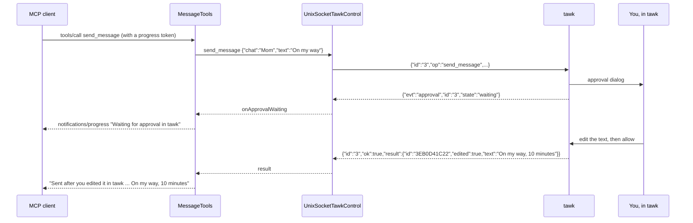
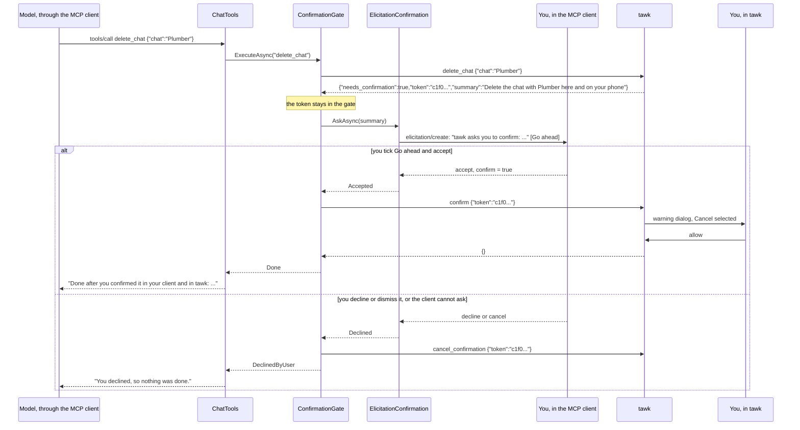
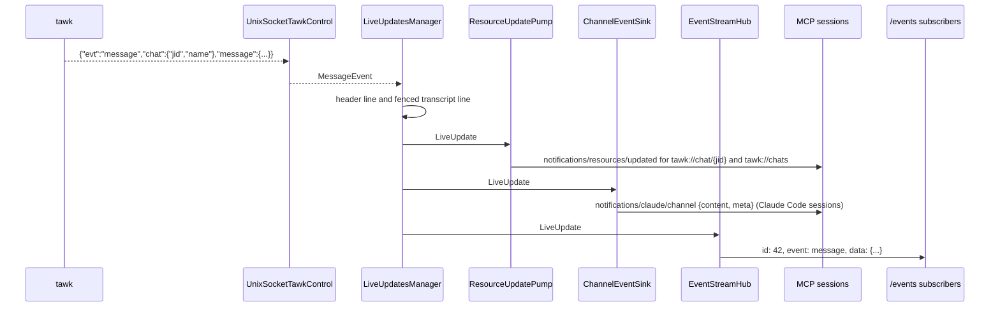
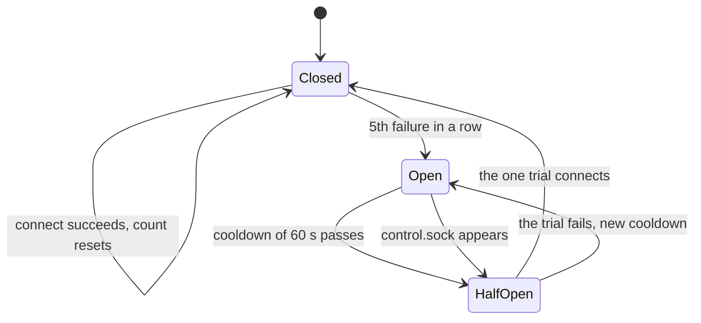
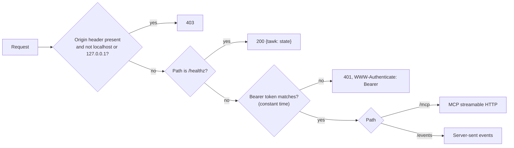
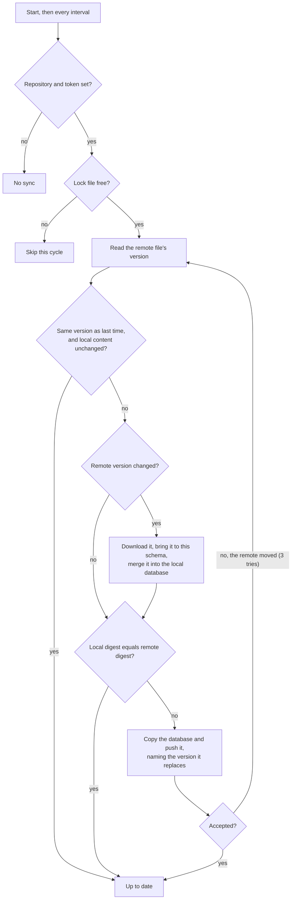
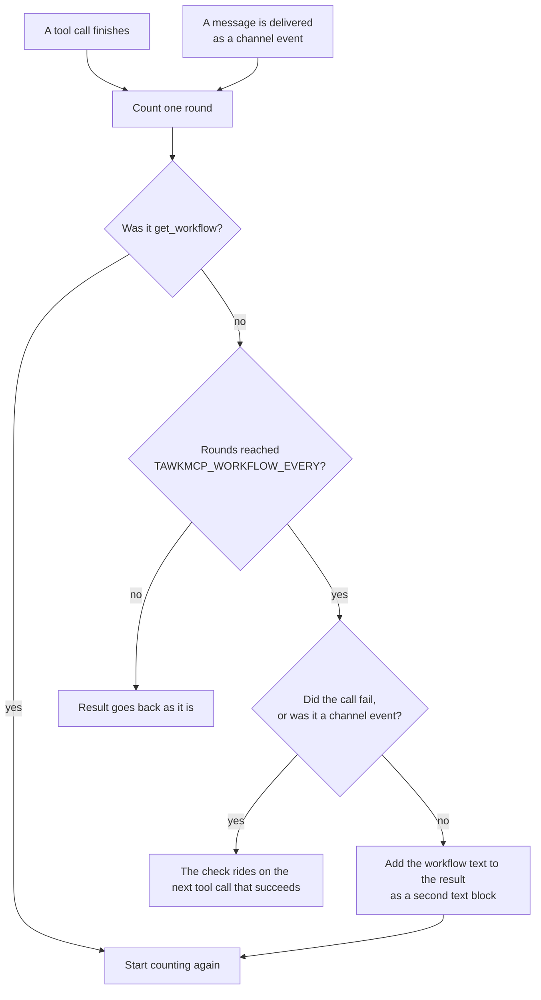

# How It Works

## Table of Contents

- [Start-up](#start-up)
- [Connecting to tawk](#connecting-to-tawk)
- [A read](#a-read)
- [A send with approval](#a-send-with-approval)
- [A destructive request in two steps](#a-destructive-request-in-two-steps)
- [New messages](#new-messages)
- [Reconnecting](#reconnecting)
- [The circuit breaker](#the-circuit-breaker)
- [A hung tawk](#a-hung-tawk)
- [HTTP requests](#http-requests)
- [A memory sync](#a-memory-sync)
- [The workflow check](#the-workflow-check)

## Start-up

1. `Program` binds the options from `TAWKMCP_*` variables and the command line. A bad value stops it with exit code 2.
2. `print-token`, `healthcheck`, `--version` and `--help` run and exit.
3. Otherwise the composition root registers every service. By default `WebApplication` starts Kestrel on `TAWKMCP_BIND:TAWKMCP_PORT` (127.0.0.1:8765) with stateful streamable HTTP sessions, creating the bearer token first if there is none. With `--stdio` the generic host starts with the stdio transport and logs to stderr only.
4. Two hosted services start: the connection supervisor, which starts connecting to tawk, and the notification dispatcher, which starts reading tawk's events. Neither waits for tawk, so the MCP server is ready at once whether or not tawk is running.

## Connecting to tawk



`hello` is always the first request on a connection, with origin `mcp`, which makes tawk ask you before every write. If the socket is missing, refuses the connection or is a stale file, the attempt fails and the supervisor waits (see [Reconnecting](#reconnecting)).

## A read



If tawk answers with an error, `ControlConnection` completes the request with a `TawkControlException`, and the tool turns it into an error result with a plain explanation, for example the candidates for an `ambiguous` name. Reading never marks anything as read.

## A send with approval



A write has no timeout on tawk-mcp's side while it waits for you; tawk answers `timed_out` after 2 minutes. If you decline, tawk answers `declined` and the tool says so. If tawk quits while the request waits, the request fails with a message saying the send may or may not have gone.

## A destructive request in two steps



The model sees the tool call and its result. It never sees the token, and the elicitation goes from tawk-mcp to your client directly, so the model can answer neither question. There is no confirm tool. If the client does not support elicitation, the gate cancels at once and the tool answers "This needs your confirmation, and your MCP client cannot ask you. Do it in tawk instead."

## New messages



Unread count changes (`{"evt":"chat"}`) update resources and go to `/events` as `event: chat`. Sessions that have gone away are dropped when a notification to them fails.

## Reconnecting

```mermaid
sequenceDiagram
    participant K as tawk
    participant C as ControlConnection
    participant S as TawkConnectionSupervisor
    participant W as SocketFileWatcher
    participant L as LiveUpdatesManager
    participant P as ResourceUpdatePump

    K-->>C: {"evt":"bye"}, then the socket closes
    C->>C: fail waiting requests with Offline ("tawk quit")
    C-->>L: ConnectionStateEvent(Waiting)
    L-->>P: event: tawk {"state":"waiting"} also goes to /events
    S->>S: log "tawk went away; retrying"
    loop until tawk is back
        S->>S: wait backoff (500 ms doubling to 30 s, jittered), or a signal
        S->>K: connect: ENOENT or ECONNREFUSED
    end
    K->>W: control.sock appears
    W-->>S: signal (and a forced trial if the circuit is open)
    S->>K: connect, hello
    S->>S: log "Connected to tawk 0.6.4"
    C-->>L: ConnectionStateEvent(Connected)
    L->>K: subscribe {"chats":"all"}
    L-->>P: every subscribed resource gets notifications/resources/updated, then list_changed
```

While tawk is away, a tool call waits up to 2 seconds for a connection and then answers with the not-running message and the socket path. When the socket's folder does not exist yet, the watcher watches the nearest existing parent and moves down as folders appear.

## The circuit breaker



While the circuit is open, tool calls fail at once with "tawk has not answered N attempts; next try in Xs (or as soon as its control socket appears)", `/healthz` reports `circuit_open`, and `/events` subscribers get `event: tawk` with `{"state":"circuit_open"}`.

## A hung tawk

A read that gets no answer within 10 seconds (`TAWKMCP_REQUEST_TIMEOUT_S`) fails with an Offline error saying tawk looks hung. The control client counts it as a breaker failure and drops the connection, and the supervisor reconnects as after any other loss. Writes are exempt, because they may be waiting for you.

## HTTP requests



`/events` starts with a `: connected` comment and the current `event: tawk` state, replays kept events after `Last-Event-ID`, then streams new ones, with a `: heartbeat` comment after 15 quiet seconds.

## A memory sync



The merge takes each table in turn and matches rows by key. Where both sides have a row, the stronger source wins (user, contact, imported, inferred), then the newer `updated`, and an exact tie is settled by the row's content so both machines choose the same one. A delete leaves a tombstone: one newer than the winning row removes it everywhere, and a row changed after its tombstone survives and clears it. Rows that have lapsed are dropped before the merge and never brought back. Deleting a contact takes its fields, categories and observations with it on every machine.

The digest is a SHA-256 over the rows and tombstones in a fixed order, not over the file's bytes, so two machines holding the same memory compare equal and neither pushes.

## The workflow check



Each tool call passes through a filter after it has run. The filter counts a round, and when the count reaches `TAWKMCP_WORKFLOW_EVERY` it adds the workflow text to the result as a second text block and starts again. A message delivered to the agent as a channel event counts as a round too, and the check then rides on the agent's next tool call. A failed call counts but never carries the check, and `get_workflow` resets the count. The text is fixed in the source, followed by the user's own instructions file; nothing from a chat or from memory is ever part of it.
